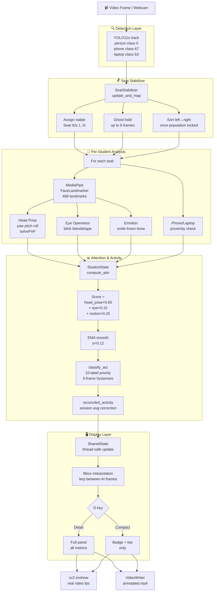
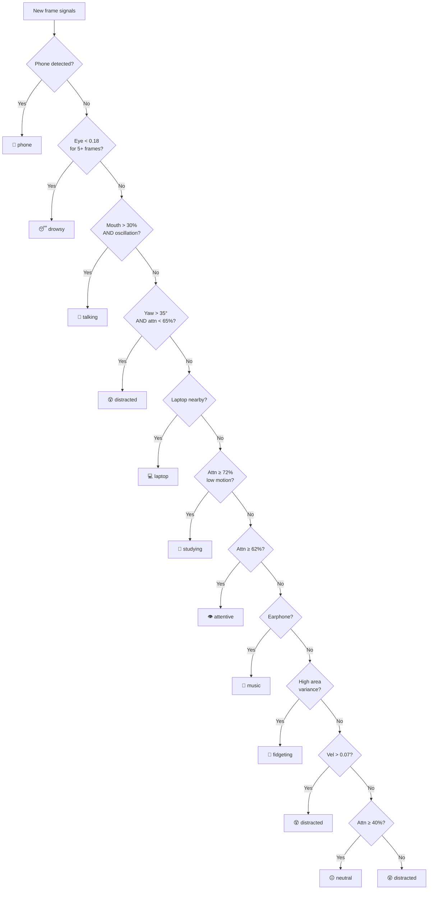

<div align="center">

# 🎓 SmartClass AI

### Real-Time AI-Powered Classroom Attention Monitoring System

[](https://python.org)
[](https://ultralytics.com)
[](https://mediapipe.dev)
[](https://fastapi.tiangolo.com)
[](https://react.dev)
[](LICENSE)
[](tests/brutal_test.py)

*Detects every student · Tracks attention in real time · Classifies behaviour · Runs 100% locally*

</div>

---

## 📸 What It Looks Like

```
┌─────────────────────────────────────────────────────────────────────────┐
│  SmartClass AI   DETAIL 1.0x  AI:428ms                                  │
│  FPS:15.0   t=45s                                                        │
│  Students:12  Study:8  Dist:2                                            │
│  Class Attn: 79%  [████████████░░░]                                      │
│                                                                          │
│   ┌──────┐  ┌──────┐  ┌──────┐  ┌──────┐  ┌──────┐  ┌──────┐          │
│   │ S1   │  │ S2   │  │ S3   │  │ S4   │  │ S5   │  │ S6   │          │
│   │STUDY │  │FOCUS │  │FOCUS │  │IDLE  │  │STUDY │  │FOCUS │          │
│   │ 84%  │  │ 91%  │  │ 75%  │  │ 69%  │  │ 86%  │  │ 78%  │          │
│   │[████]│  │[████]│  │[███░]│  │[███░]│  │[████]│  │[████]│          │
│   └──────┘  └──────┘  └──────┘  └──────┘  └──────┘  └──────┘          │
└─────────────────────────────────────────────────────────────────────────┘
```

---

## 🚀 Table of Contents

1. [Overview](#-overview)
2. [Key Features](#-key-features)
3. [AI Pipeline Architecture](#-ai-pipeline-architecture)
4. [Tech Stack](#-tech-stack)
5. [Project Structure](#-project-structure)
6. [Quick Start](#-quick-start)
7. [Running the System](#-running-the-system)
8. [Key Controls](#-key-controls)
9. [Attention Score System](#-attention-score-system)
10. [Activity Classification](#-activity-classification)
11. [Configuration Reference](#-configuration-reference)
12. [Performance](#-performance)
13. [Test Suite](#-test-suite)
14. [Output Files](#-output-files)
15. [Privacy & Security](#-privacy--security)

---

## 🎯 Overview

SmartClass AI is a complete AI-powered classroom monitoring platform built for Indian classrooms. It uses state-of-the-art computer vision to track every student's attention in real time — entirely offline, with no cloud dependency.

The system processes classroom video or live webcam feeds and for each student produces:

- A **0–100% attention score** computed from head pose, eye openness, and motion
- A **behaviour label** (studying, attentive, talking, distracted, drowsy, phone, etc.)
- A **full activity timeline** for the session
- A **session report** with per-seat averages, peaks, and final activity

### Real Classroom Results (466-second test video, 12 students)

```
  Seat   Avg      Peak     Low    Activity
  ──────────────────────────────────────────────────────
  1      72.3%    82.2%   63.8%  attentive
  2      81.5%    85.1%   76.8%  studying
  3      75.6%    81.0%   67.9%  attentive
  4      75.2%    85.2%   65.8%  studying
  5      86.2%    93.5%   79.4%  studying
  6      83.0%    92.1%   70.3%  studying
  7      86.9%    91.6%   62.7%  studying
  8      72.7%    85.4%   57.8%  studying
  9      72.0%    89.2%   51.0%  attentive
  10     83.7%    92.6%   67.1%  studying
  11     84.4%    93.1%   63.1%  studying
  12     88.4%    93.6%   72.7%  studying
  ──────────────────────────────────────────────────────
  Class avg attention : 79.8%
```

---

## ✨ Key Features

| Feature | Description |
|---------|-------------|
| 🎯 **Real-time detection** | YOLO11s detects all students every frame |
| 🪑 **Stable seat IDs** | Seats locked left-to-right, never re-numbered during session |
| 👻 **Ghost hold** | Temporarily occluded students held for 8 frames — count never flickers |
| 🧠 **MediaPipe landmarks** | 468 facial landmarks → head pose + eye + emotion per student |
| 📊 **Attention scoring** | Weighted formula: head pose (60%) + eye (15%) + motion (25%) |
| 🏷️ **10 activity labels** | studying, attentive, neutral, talking, distracted, drowsy, phone, laptop, music, fidgeting |
| 🔄 **Hysteresis** | 5-frame stability filter prevents label flickering |
| 🎞️ **Bbox interpolation** | Boxes glide smoothly between AI frames — no jumping |
| 🧵 **Threaded pipeline** | AI and display run in separate threads — display never blocked |
| 📱 **Phone detection** | YOLO class 67 — alerts when student uses phone |
| 💻 **Laptop detection** | YOLO class 63 — detects laptop usage |
| 🔍 **Overlap suppression** | IoU-based NMS prevents one person appearing as two |
| 🌐 **Web dashboard** | React + FastAPI for student registration, reports, attendance |
| 🔒 **100% local** | No data leaves your machine |

---

## 🔬 AI Pipeline Architecture



---

## 📐 Attention Score System

The attention score is a 0–100% observable engagement proxy:

```
┌─────────────────────────────────────────────────────────┐
│              ATTENTION SCORE FORMULA                     │
│                                                          │
│  score = (                                               │
│    head_pose_score × 0.60   ← dominant factor            │
│  + eye_score       × 0.15                                │
│  + motion_score    × 0.25                                │
│  ) × 100 × eye_penalty                                   │
│                                                          │
│  head_pose_score:                                        │
│    yaw_score  = 1 - max(0, |yaw|-35°) / 25  (0-1)       │
│    pitch_score= 1 - max(0, |pitch|-25°) / 25 (0-1)       │
│    = yaw×0.6 + pitch×0.4                                 │
│                                                          │
│  eye_score    = 1 - blink_blendshape  (0=closed, 1=open) │
│  eye_penalty  = eye/0.3 if eye < 0.3 else 1.0            │
│                                                          │
│  motion_score = vel×0.35 + osc×0.25 + area_var×0.25     │
│               + drift×0.15  (all penalise movement)      │
└─────────────────────────────────────────────────────────┘
```

### Score Interpretation

```
 0%  ──────────────────────────────────────── 100%
 │          │          │          │          │
CRITICAL   LOW       MEDIUM      HIGH     PERFECT
 <40%     40-60%    60-75%     75-90%     90-100%
  🔴        🟠        🟡         🟢         🟢
```

### Why head pose is 60% of the score

A student can have perfect eye openness but be completely turned away from the board. Head orientation is the strongest observable signal of whether a student is paying attention to the teacher. The 60% weight reflects this reality.

Natural classroom movements are NOT penalised:
- Writing causes pitch of ~15-20° downward → not penalised (threshold is 25°)
- Looking at neighbours causes yaw of ~20-30° → not penalised (threshold is 35°)
- Only significant deviations are counted as distraction

---

## 🏷️ Activity Classification



### 5-Frame Hysteresis

Every candidate activity must be stable for **5 consecutive frames** before it's committed. This prevents rapid flickering when signals are noisy.

```
Frame:    1      2      3      4      5      6      7
Candidate: studying talking talking talking talking talking COMMITTED
Display:   studying studying studying studying studying studying talking
                                                              ↑ committed after 5 frames
```

---

## 🛠️ Tech Stack

```
┌─────────────────────────────────────────────────────────────┐
│                    SmartClass AI Stack                       │
├──────────────────────────┬──────────────────────────────────┤
│ AI / Computer Vision     │ Web Platform                     │
│ ─────────────────────    │ ──────────────────────           │
│ YOLO11s (Ultralytics)    │ React 18 + Vite                  │
│ MediaPipe FaceLandmarker │ FastAPI 0.115                     │
│ OpenCV 4.13              │ SQLAlchemy + SQLite               │
│ NumPy                    │ Recharts (analytics)             │
│ Pillow                   │ Lucide React (icons)             │
│ InsightFace (optional)   │ React Router 6                   │
│ face_recognition (opt.)  │                                  │
│ ONNX Runtime (opt.)      │                                  │
├──────────────────────────┴──────────────────────────────────┤
│ Infrastructure                                               │
│ ─────────────────────                                        │
│ Python 3.10+  │  Node.js 18+  │  Local SQLite DB            │
│ Threaded pipeline (AI thread + Display thread)               │
│ Zero cloud dependency — 100% offline                         │
└─────────────────────────────────────────────────────────────┘
```

---

## 📁 Project Structure

```
Classroom_Detector_Ak/
│
├── 📄 README.md                         ← You are here
├── 📄 .gitignore
│
├── ── 🚀 RUNNER SCRIPTS ──────────────────────────────────────
├── 🐍 test_real_classroom.py            ← Main threaded video runner
├── 🐍 run_webcam.py                     ← Live webcam monitoring
├── 🐍 run_video.py                      ← Simple video runner
├── 🐍 scan_classroom.py                 ← Scan empty classroom → seat map
│
├── ── 🎬 REAL CLASSROOM DEMO ─────────────────────────────────
├── 📂 classrom video of wit/
│   ├── 📄 README.md                     ← Guide for this folder
│   ├── 🐍 setup.py                      ← Auto-download video + run
│   ├── 🐍 analyze.py                    ← Self-contained analysis script
│   ├── 🔧 run.bat                       ← One-click Windows launcher
│   ├── 📂 videos/                       ← Downloaded by setup.py
│   └── 📂 outputs/                      ← Generated analysis outputs
│
├── ── 🧠 AI ENGINE ───────────────────────────────────────────
├── 📂 backend/
│   ├── 🐍 main.py                       ← FastAPI REST server
│   ├── 📄 requirements.txt              ← Python dependencies
│   └── 📂 core/
│       ├── ⚙️  config.py               ← All tunable parameters
│       ├── 🔧 engine.py                 ← Unified AI orchestrator
│       ├── 🔍 detector.py               ← YOLO + MediaPipe pipeline
│       ├── 🪑 stabilizer.py             ← Seat ID + ghost hold
│       ├── 📊 student_state.py          ← Attention math + classifier
│       ├── 📅 behavior_tracker.py       ← Activity timeline
│       ├── 🖥️  visualizer.py           ← All overlay rendering
│       ├── 👤 face_recognition_engine.py← InsightFace / fallback
│       ├── 🗺️  classroom_mapper.py     ← Desk layout detection
│       ├── 📝 report_generator.py       ← Session report builder
│       ├── 🤖 ollama_labeler.py         ← Optional LLM seat naming
│       └── 💾 database.py               ← SQLAlchemy + SQLite
│
├── ── 🤖 MODELS ──────────────────────────────────────────────
├── 📂 models/
│   ├── yolo11s.pt                       ← YOLO11 weights (not in git)
│   └── face_landmarker.task             ← MediaPipe model (3.6 MB, in git)
│
├── ── 🌐 FRONTEND ────────────────────────────────────────────
├── 📂 src/
│   ├── App.jsx / main.jsx / api.js
│   └── 📂 pages/
│       ├── Classroom.jsx                ← Live monitoring view
│       ├── Students.jsx                 ← Student registration
│       ├── Sessions.jsx                 ← Session history
│       ├── Reports.jsx                  ← Analytics & charts
│       └── TestVideo.jsx                ← Browser video upload
│
├── ── 🧪 TESTS ───────────────────────────────────────────────
├── 📂 tests/
│   ├── brutal_test.py                   ← 65 automated tests
│   └── test_all/fixes/scanner/webcam...
│
└── 📂 scratch/                          ← Experimental (not production)
```

---

## ⚡ Quick Start

### Prerequisites

- Python 3.10+
- pip
- Node.js 18+ *(only for web dashboard)*
- `models/yolo11s.pt` *(download separately — 18 MB)*

### Install

```bash
git clone https://github.com/Akhilesh-raje/Classroom_Detector_Ak.git
cd Classroom_Detector_Ak
pip install -r backend/requirements.txt
```

### Run the real classroom demo (auto-downloads video)

```bash
cd "classrom video of wit"
python setup.py
```

`setup.py` will:
1. ✅ Check all dependencies
2. ⬇️ Download the 957 MB classroom video from Google Drive (first run only)
3. 🚀 Launch the analyzer automatically

---

## 🎮 Running the System

### Option 1 — Real classroom demo (recommended first run)

```bash
cd "classrom video of wit"
python setup.py           # downloads video + runs
python analyze.py         # run directly if video already downloaded
```

### Option 2 — Any video file

```bash
python test_real_classroom.py
python test_real_classroom.py "path/to/your/video.mp4"
```

### Option 3 — Live webcam

```bash
python run_webcam.py
```

### Option 4 — Web dashboard

```bash
# Terminal 1 — backend API
python backend/main.py

# Terminal 2 — frontend
npm install
npm run dev
```

Open `http://localhost:3000`

### Option 5 — Scan empty classroom (seat mapper)

```bash
python scan_classroom.py
```

---

## 🎮 Key Controls

### Video Playback Controls

| Key | Action |
|-----|--------|
| `D` | Toggle **Detail** ↔ **Compact** overlay mode |
| `SPACE` | Pause / Resume |
| `+` or `=` | Speed up (max 4×) |
| `-` or `_` | Slow down (min 0.25×) |
| `Q` / `ESC` | Quit and save report |

### Overlay Modes

**Detail Mode** — Full per-student metrics panel:

```
┌─ S3 R1C3 ─────────────────────┐
│ STUDY              84%        │
│ [████████████░░░░░░░░░░]      │
│ Avg 81%                       │
│ [██████████░░]                │
│ Emo: neutral                  │
│ Y:+5  P:-12                   │  ← Head yaw / pitch (degrees)
│ Eye:0.87 [████████████░░]     │  ← Eye openness ratio
│ HP:0.91 Mo:0.88               │  ← Attention factors
│ momentarily distracted        │  ← Reconciliation note
└───────────────────────────────┘
```

**Compact Mode** — Single badge + bar:

```
S3 STUDY 84%
[████████████████░░░░]
```

### Classroom Scanner Controls

| Key | Action |
|-----|--------|
| `SPACE` | Scan current frame |
| `S` | Save layout JSON |
| `R` | Retry / clear |
| `N` | Switch camera |
| `0–9` | Select camera index |
| `+` / `-` | Zoom in / out (1x – 8x) |
| `W A S D` | Pan when zoomed |
| `0` | Reset zoom |
| `Q` / `ESC` | Quit |

---

## ⚙️ Configuration Reference

### `backend/core/config.py`

```python
# ── Detection ─────────────────────────────────────────
YOLO_MODEL_PATH = "yolo11s.pt"  # Model file (can use .onnx for 2-3× speedup)
YOLO_CONF       = 0.18          # Detection threshold. Raise to 0.30-0.40 for cleaner results
PERSIST         = True           # YOLO tracking — keep True for stable IDs

# ── Seat Tracking ──────────────────────────────────────
MAX_SEATS            = 6     # Set to actual number of students
SEAT_PROXIMITY_THRES = 0.25  # Fraction of frame diagonal for seat matching
                              # Lower = stricter, less ID confusion

# ── Analysis ───────────────────────────────────────────
SMALL_BBOX_FRAC      = 0.02  # Faces < 2% frame area use upper-body crop
FACE_MATCH_INTERVAL  = 30    # Run face recognition every N frames
FACE_MATCH_THRESHOLD = 0.75  # Cosine similarity for identity confirmation
HYSTERESIS_FRAMES    = 5     # Frames for activity label to stabilise

# ── Smoothing ──────────────────────────────────────────
EMA_A    = 0.12  # Attention EMA alpha. Lower = smoother, slower to react
HIST_LEN = 90    # Attention history (90 frames ≈ 3s at 30fps)
```

### `test_real_classroom.py` / `analyze.py` overrides

```python
MAX_SEATS    = 15    # Raise for larger classrooms
YOLO_CONF    = 0.30  # Higher confidence = fewer ghost detections
IOU_SUPPRESS = 0.45  # Overlap NMS threshold (raise if students merge)
AI_EVERY     = 2     # AI every N frames. 1=accurate/slow, 4=fast/slight lag
```

---

## 📊 Performance

### Benchmarks

```
┌─────────────────────────────────────────────────────────────────┐
│  Hardware               │ AI Latency │ Display FPS │ Students   │
│─────────────────────────┼────────────┼─────────────┼────────────│
│  CPU (i5/Ryzen 5)       │  400-500ms │   12-16 fps │  up to 15  │
│  CPU (i7/Ryzen 7)       │  250-350ms │   15-20 fps │  up to 15  │
│  NVIDIA GPU (CUDA)      │   30-50ms  │   28-30 fps │  up to 30  │
│  Apple M1/M2            │   80-120ms │   25-30 fps │  up to 20  │
└─────────────────────────────────────────────────────────────────┘
```

> The display thread always runs at full video fps — AI latency only affects
> how quickly overlays update, not how smoothly the video plays.
> Bbox interpolation ensures smooth overlay animation regardless of AI speed.

### Speed-up Options

```bash
# 1. Export YOLO to ONNX (2-3× faster inference)
yolo export model=models/yolo11s.pt format=onnx
# Then set YOLO_MODEL_PATH = "yolo11s.onnx" in config.py

# 2. Reduce AI frequency in analyze.py / test_real_classroom.py
AI_EVERY = 4   # run AI every 4th frame instead of every 2nd

# 3. Downscale input (add before ai_thd.submit)
frame = cv2.resize(frame, (1280, 720))

# 4. GPU (NVIDIA)
pip install onnxruntime-gpu
# Ultralytics will auto-detect CUDA
```

---

## 🧪 Test Suite

65 automated tests covering every component:

```
Tests                                          Result
──────────────────────────────────────────────────────
1.  IMPORTS                               6 / 6  ✅
2.  STUDENT STATE — ATTENTION MATH       11 / 11 ✅
    ├ attention always in [0, 100]
    ├ phone penalty crushes score < 20
    ├ yaw=90° significantly reduces attention
    ├ zero-area bbox does not crash
    ├ NaN head pose does not propagate
    ├ EMA converges after 100 frames
    ├ reconciled_activity: high avg overrides distracted
    └ 1000 random frames — no crash, valid outputs
3.  BEHAVIOR TRACKER                      5 / 5  ✅
4.  SEAT STABILIZER                       6 / 6  ✅
    ├ empty input returns []
    ├ max_seats=0 raises ValueError
    ├ 10 detections for 3 seats — extras discarded
    ├ ID stability across 20 frames
    ├ left-to-right sorting after discovery
    └ jitter never causes ID flip
5.  CLASSROOM MAPPER                      6 / 6  ✅
6.  IOu + OVERLAP SUPPRESSOR              9 / 9  ✅
7.  VISUALIZER CRASH SAFETY               9 / 9  ✅
    ├ all activity types render without crash
    ├ bbox at corners (0,0) and (W,H)
    └ 10 simultaneous overlays on 1080p
8.  ENGINE SYNTHETIC FRAMES               7 / 7  ✅
9.  CONFIG SANITY                         5 / 5  ✅
10. REAL VIDEO REGRESSION (60 frames)     1 / 1  ✅
    └ avg 12.1 detections, all outputs valid
──────────────────────────────────────────────────────
TOTAL: 65 / 65   ██████████████████████████  100% ✅
```

### Run tests

```bash
python tests/brutal_test.py
```

---

## 📤 Output Files

| File | Where | What's in it |
|------|-------|-------------|
| `annotated.mp4` | `outputs/` or `classrom video of wit/outputs/` | Full video with AI overlays burned in at original fps |
| `report.txt` | Same | Per-seat: avg, peak, low attention + final activity + class average |
| `classroom_layout.json` | `outputs/` | Seat map: pixel coords, row/col labels, seat names |
| `classroom_layout.png` | `outputs/` | Annotated photo with detected seats highlighted |
| `classroom_layout_grid.png` | `outputs/` | Clean grid overlay on classroom photo |
| `smartclass.db` | `backend/` | SQLite: students, sessions, attendance, face encodings |
| `scratch/webcam/reports/*.json` | `scratch/` | Sample session reports from earlier webcam runs |

### Sample `report.txt`

```
SmartClass AI — Classroom Analysis Report
==================================================
Video    : real_classroom.mp4
Size     : 1920x1080 @ 30.0fps
Duration : 466s (13973 frames)
Run time : 221.15s
AI ms    : 444.9ms avg

  Seat   Avg     Peak    Low   Activity
  ------------------------------------------------------------
  1      72.3%   82.2%   63.8%  attentive
  2      81.5%   85.1%   76.8%  studying
  ...
  ------------------------------------------------------------
  Class avg attention : 79.8%
```

---

## 🔒 Privacy & Security

```
┌─────────────────────────────────────────────────────────┐
│  ✅ All AI processing runs on YOUR machine              │
│  ✅ No video frames sent to any server                  │
│  ✅ No face data uploaded anywhere                      │
│  ✅ Biometrics stored ONLY in local SQLite              │
│  ✅ No internet required to run                         │
│  ✅ Delete all data: del backend\smartclass.db          │
└─────────────────────────────────────────────────────────┘
```

---

## 🗂️ Getting the Models

The AI models are not included in the repository due to size.

| Model | Size | How to get |
|-------|------|-----------|
| `yolo11s.pt` | ~18 MB | `pip install ultralytics` then `from ultralytics import YOLO; YOLO('yolo11s.pt')` — auto-downloads |
| `face_landmarker.task` | ~3.6 MB | Already in the repo at `models/face_landmarker.task` |

Place `yolo11s.pt` in the `models/` folder before running.

---

## 📋 Requirements Summary

```
Python 3.10+
├── ultralytics        (YOLO11)
├── mediapipe          (FaceLandmarker)
├── opencv-python      (video I/O, rendering)
├── numpy              (math)
├── Pillow             (image processing)
├── fastapi            (REST API)
├── uvicorn            (ASGI server)
├── sqlalchemy         (ORM)
├── aiosqlite          (async SQLite)
├── colorama           (coloured console)
├── requests           (HTTP client)
├── pydantic           (data validation)
└── [optional]
    ├── insightface    (real face recognition — requires C compiler)
    ├── face-recognition (alternative face recognition)
    └── onnxruntime    (faster YOLO inference)

Node.js 18+ (web dashboard only)
├── react 18
├── react-router-dom 6
├── recharts
└── lucide-react
```

---

## 👨‍💻 Author

**Akhilesh Raje**
- GitHub: [@Akhilesh-raje](https://github.com/Akhilesh-raje)
- Project: [Classroom_Detector_Ak](https://github.com/Akhilesh-raje/Classroom_Detector_Ak)

---

<div align="center">

*Built for real Indian classrooms · YOLO11s + MediaPipe · 100% local · No cloud*

⭐ If this helped you, give it a star!

</div>
